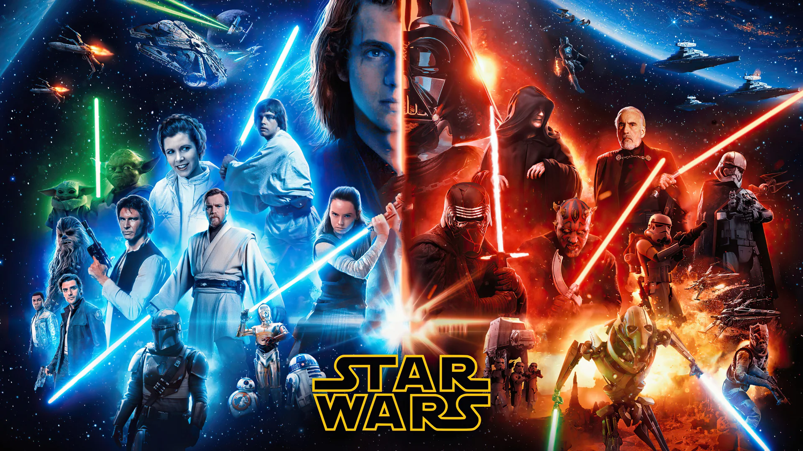

# Kirs_M_HW3

## Best Movies Of The Greatest Directors API

## Overview  
This project is a movie website that works with a custom API. Instead of just showing static content, it loads movie data from the backend and displays it on the page. The goal was to create something more interactive than a simple list of my favorite movies.

I built this project to practice working with APIs and connecting a backend to a frontend. It also helped me improve how I structure data and display it in a clean and understandable way.

For the backend, I used Laravel to create the API and manage the movie data. I worked with models, controllers and routes to organize how the data is handled, and used migrations to structure the database. I also used seeders and factories to generate and insert movie data, including titles, directors, and image paths. This made it easier to test the API and keep everything organized and consistent.

On the frontend, I used JavaScript with Vue to fetch the data and update the page dynamically without reloading.

On this page, users can browse through movies, click on them, and see more detailed information like the title, director and image. The idea is to make the experience simple but interactive.

---

## Features  
- Fetch movie data from a custom Laravel API  
- Display movie titles dynamically with Vue  
- Load selected movie details with a second API call  
- Show movie title, director and poster image  
- Loading icons for movie list and movie details  
- Error handling for failed requests  
- Responsive design from mobile to desktop  
- GreenSock animations for page sections and interactions  
- Modular JavaScript structure  

---

## Tech Stack  
- **Frontend:** HTML, SASS, JavaScript, Vue 3  
- **Backend:** Laravel  
- **Animation:** GSAP  
- **Version Control:** Git & GitHub  

---

## Structure  
The project includes:

- A hero section  
- An about section  
- A movie list section  
- A movie details section  
- A responsive header and footer  
- Separate JavaScript modules for app logic, menu functionality, animations and SmoothScroll  

---

## Purpose  
This assignment was created to:  
- Practice working with APIs and AJAX requests  
- Connect a Laravel backend with a frontend interface  
- Improve working with dynamic data in Vue  
- Build a responsive and interactive movie page  
- Add animations to improve the user experience  

---

**Laravel API project**

- [Laravel API project](https://github.com/Mikki667/Kirs_Mikhail_Laravel_API)

---

## Workflow Notes  
This project was built step by step based on the class example and then adapted into my own movie idea. I started by building the Laravel backend, where I created the database structure using migrations and set up models and controllers to handle the movie data. I also used seeders and factories to populate the database with my custom movie list and make sure the API was working correctly.

After that, I moved to the frontend and made the API calls work correctly, then built the dynamic list and the movie details section. Once the functionality was working, I focused on styling the layout and making it responsive for mobile, tablet, and desktop. Finally, I added GreenSock animations to make the page feel more dynamic.

---

## Commit History  

**Note: for both of my classes I was keeping the notes on my google docs in order to document my work properly**

# Update: Folder Structure

In this commit I added my default folder structure, which includes the folders such as: assets, css, images, js and sass. I also added an empty html file and .gitignore in order to ignore assets. In css folder you might see my grid css, main css and css map files. Images is an empty folder for now. In js folder I added main.js file. In sass I have my usual setup which includes files such as abstracts, base, components and pages along with main.sccs file. Sass works appropriately. 

# Update: HTML 

In this commit I added the class example for the Book Store API and started modifying it by transforming the project into my Movie Theme. I also added the svg loader that I downloaded from the internet. 

# Update: JavaScript and HTML 

In this commit I added the JavaScript file from the class example and adapted it to work with my movies API. I changed the variable names and endpoints to match my project and connected both data calls. I also updated the HTML by adding the correct Vue bindings such as v-for, :key and @click, so the movie list can be rendered and interacted with. I also did some slight changes in JS in order to adapt it for my custom data I put into the API. In the end I tested if the code actually works, and, yes, it does. 

# Update: JavaScript and HTML 

In this commit I added the ability to translate the “image_url” from my API.

# Update: CSS

In this commit I added variables for my sass in order to organize my css. I chose the colors for the layout, the text and also added variables for spacing.  

# Update: HTML

In this commit I adjusted the layout of the page by adding grid classes so now i have the movie list on the right and movies images along with info on the left. 

# Update: CSS

In this commit I did some styling for my movie-list-con to make it look not like the default css for buttons. In my components for sass I created a “movie-list” file where I added some styling for this section. I was working primarily on adjusting the text layout and also making it responsive for the desktop, tablet and mobile. The idea is that on the desktop the list of the movies spreads across three columns, but on tablet and mobile it turns into a vertical list. I also added some hover for the styling as well. 

# Update: CSS

In this commit I added some styling for my section with information about the movies and also made it responsive for the image for desktop, mobile and tablet. 

# Update: CSS

In this commit I adjusted the container with my movie list to better fit the mobile version. Also, I put the list container and an image container into a section and wrapped it in a purple color. However, I might change the colors in the future, but right now it is starting to look like a proper page. 

# Update: HTML and CSS

In this commit I updated my html by adding the “About The Project” section. There I explained the idea of the project, how it was built and the interactive functionalities you can find on the web page. I styled it with css and made it responsive for desktop, tablet and mobile. 

# Update: HTML and CSS

In this commit I added the header which is a standard header that I use for my assignments that we built in class. It also uses a hamburger menu that I will later add JavaScript Functionality. I also have it styled with css, but did not have to change anything because for my variables I used the same structure as before.  

# Update: HTML and CSS

In this commit I added the footer which I also previously used in my assignment, I decided to connect the footer and the section above together, because I found it to be nice looking and fitting the website better. 

# Update: HTML and CSS 

In this commit I added the hero section with a title and a back-ground image. The thing is that on the mobile the back-groud hero changes, which adds interesting customization and personality. Additionally I adjusted the loader to make it a smaller size. 

# Update: JavaScript

In this commit I started dividing my JavaScript into modules and created an app module and connected it with the main js. 

# Update: JavaScript

In this commit I added my standard JavaScript for the header functionality which allows me to use hamburger menu. 

# Update: JavaScript

In this commit I added some GreenSock animations for the main sections of the page like about section, movie list and footer to make the experience more interactive.

# README file Update

In this commit I added my readme file that I was working on throughout the process of doing both of the assignments for both of the classes. 

---

## Installation  
No installation is required for the front-end part.  

To fully run the project, the Laravel backend should be running locally so the API requests can fetch the movie data correctly.

---

## Usage  
Open the project in a local browser environment while the Laravel API is running. Users can click on movie titles in the list and the page will dynamically load more information about the selected movie.

---

## Credits  
Mikhail Kirs  

## License  
MIT License  

**Contact:**  
- [topkun6666@gmail.com](mailto:topkun6666@gmail.com)  
- +1 (226) 224-6074  
- [GitHub Profile](https://github.com/Mikki667)  
- [My Portfolio](https://michaelkirsweb.ca/)  
